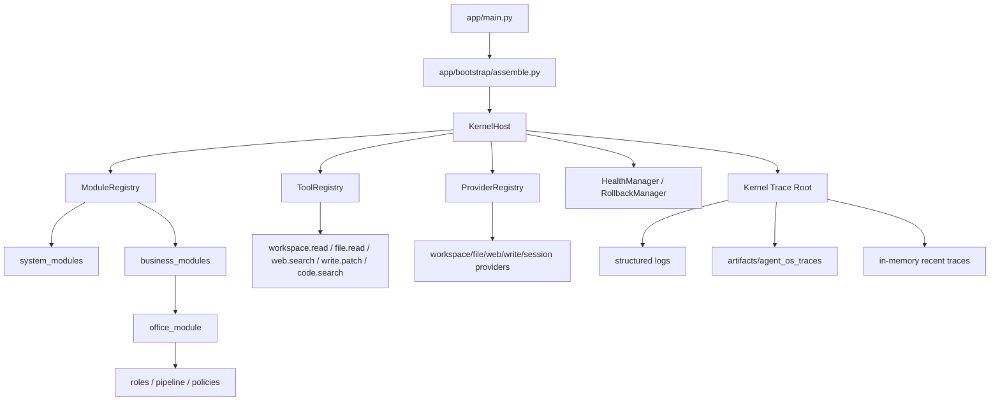

# Agent OS Map

```mermaid
flowchart TD
  A["app/main.py"] --> B["app/bootstrap/assemble.py"]
  B --> C["KernelHost"]
  C --> D["ModuleRegistry"]
  C --> E["ToolRegistry"]
  C --> F["ProviderRegistry"]
  C --> G["HealthManager / RollbackManager"]
  C --> H["Kernel Trace Root"]
  D --> I["system_modules"]
  D --> J["business_modules"]
  J --> K["office_module"]
  K --> L["roles / pipeline / policies"]
  E --> M["workspace.read / file.read / web.search / write.patch / code.search"]
  F --> N["workspace/file/web/write/session providers"]
  H --> O["structured logs"]
  H --> P["artifacts/agent_os_traces"]
  H --> Q["in-memory recent traces"]
```
