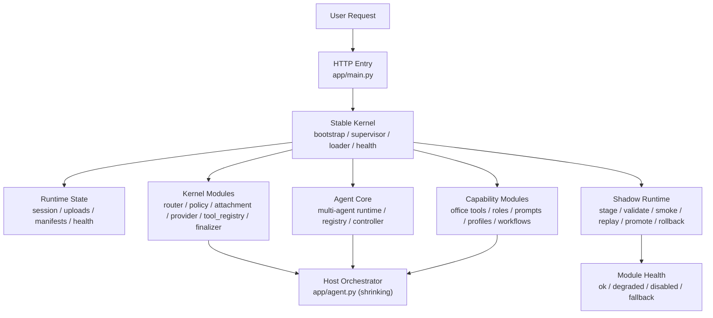
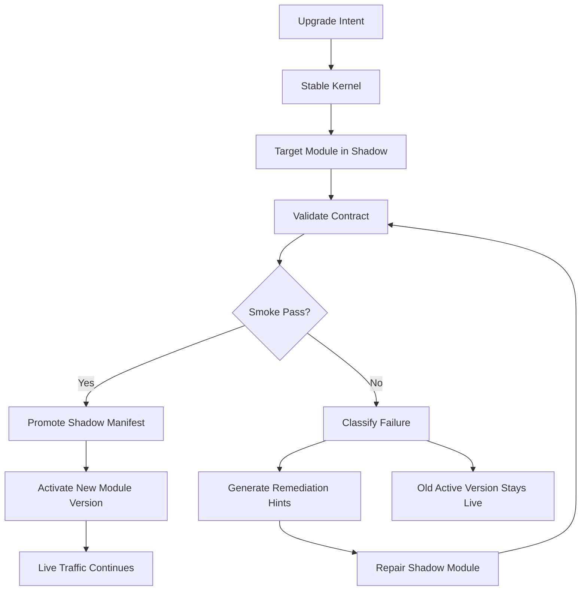

# 模块化内核架构

## 目标

这套系统要演进成一个“稳定内核 + 可替换模块 + 可回滚升级”的运行时。

核心要求只有一个：

- 内核保持简单、稳定、直接
- 外围能力模块化、可替换、可回滚
- 单个模块坏掉时，不拖垮整条链路
- 自我修复只作用于 `shadow` 模块，不直接改线上主干

## 当前结构

当前系统正在收敛成统一宿主，不再把“模块”和“多 agent”看成对立关系。

当前最重要的 4 个一等公民对象是：

- `KernelHost`：机械式主核入口。只负责启动、装配、调度、健康与回滚。
- `AgentModule`：可升级的智能体能力模块。内部可以继续是多 agent pipeline。
- `ToolModule`：可升级的工具能力模块。负责提供动作执行器，并通过 `ToolExecutionBus` 接入主核。
- `Blackboard`：一次请求的共享状态面板。主核和模块通过它交换任务状态。

现在需要区分两类模块：

- `kernel modules`：主核级模块，例如 router / policy / provider / tool_registry / finalizer
- `capability modules`：能力包，例如 office 的 tools / roles / prompts / profiles / workflows

当前已经开始落地的统一三层是：

- `runtime-core`：加载、监督、shadow、promote、rollback，以及 capability loader
- `agent-core`：多 agent runtime、registry、controller、共享编排支撑
- `capability-modules`：office 具体能力包，目前为 `packages/office_modules`

当前系统已经不是单体脚本，而是一个分层运行时：

- `stable kernel` 负责加载、调度、健康检查、降级和回滚
- `agent-core` 负责多 agent 运行时
- `capability modules` 负责具体能力
- `shadow` 负责验证、冒烟、晋升和回退

当前代码上的第一批对应关系已经补上：

- `KernelHost`：`app/kernel/host.py`
- `Blackboard`：`packages/runtime_core/blackboard.py`
- `AgentModule` / `ToolModule`：`packages/runtime_core/capability_loader.py`
- `ToolExecutionBus`：`packages/runtime_core/tool_execution_bus.py`
- 默认办公 `AgentModule`：`packages/office_modules/agent_module.py`
- 默认办公 `ToolModule`：`packages/office_modules/tools.py`
- 默认办公 `OutputModule`：`packages/office_modules/output_module.py`
- 默认办公 `MemoryModule`：`packages/office_modules/memory_module.py`

历史 `packages/runtime_core/kernel_host.py` 已完成退场。兼容能力已收敛到：

- `packages/runtime_core/legacy_host_support.py`
- `AgentOSRuntime` 显式 legacy facade/helper bindings

当前对外可见的 capability modules 已开始细化为：

- `office_agent`
- `workspace_tools`
- `file_tools`
- `web_tools`
- `write_tools`
- `session_tools`
- `output_finalizer`
- `overlay_memory`

## 当前职责边界

### 内核

内核只做运行时职责，不做业务判断：

- 接请求
- 读取和写回运行时状态
- 加载 active manifest
- 解析模块版本
- 调用模块接口
- 记录健康状态
- 触发降级、回滚和晋升

### Kernel Modules

主核模块只负责系统级能力域：

- 路由
- 策略
- 附件上下文
- Provider
- Tool registry
- 最终整理

这些模块可以失败，但失败不能扩散到其他模块。

### Capability Modules

能力模块承接业务域能力：

- tools
- roles
- prompts
- runtime profiles
- workflows

以后多 agent 不会被削弱，而是会以 capability module 的形式装载和替换。

当前已经支持：

- `OFFICETOOL_CAPABILITY_MODULES` 配置多个 capability module
- loader 按顺序加载多个能力包
- role registry 由多个能力包合并
- `AgentModule` 当前由能力包显式导出
- `ToolModule` 当前由能力包显式导出
- 主核当前会选择一个主 `AgentModule` 和一个主 `ToolModule`
- `ToolExecutionBus` 当前会按 `ToolModule` 路由具体工具调用
- `Blackboard` 当前会记录 `tool_usage / tool_module_usage`
- 工具执行器已经开始按 `workspace / file / web / write / session` 分舱

### Shadow

`shadow` 是唯一允许自我修复和试错的区域：

- 先 stage
- 再 contracts
- 再 validate
- 再 smoke
- 再 replay
- 通过后 promote
- 不通过就 rollback
- 确定性故障则走 auto-repair
- 需要改代码时再走 patch worker

## 未来闭环

未来要做的是“模块级自升级闭环”，而不是“主脑直接改自己”。

## 未来自我升级流程

1. 智能体接到升级任务，只改 `shadow` 模块
2. 内核先做 contract 校验
3. 再做 shadow smoke
4. 再做 replay 或真实回放
5. 通过后原子切换 active manifest
6. 失败则保留旧版本，继续修 shadow

现在已经补上的运行时记录包括：

- `last_upgrade_run`
- `upgrade_runs`
- `last_repair_run`
- `repair_runs`
- `repair_workspaces`
- `last_package_run`
- `package_runs`

这意味着：

- 主干不因局部升级而失效
- 单模块失败可以隔离
- 升级过程可审计、可回放、可回滚

## 核心设计原则

### 1. 内核简单稳定

内核必须保持最小职责集：

- 加载
- 调度
- 健康检查
- 降级
- 回滚

内核不承载具体业务规则。

### 2. 模块可替换

每个能力域都要有明确接口和版本号。

模块的替换单位不是整套程序，而是一个能力块：

- `router`
- `policy`
- `provider`
- `tool registry`
- `finalizer`

### 3. 失败隔离

任何模块失败都应该局部化：

- `router` 坏了，回退到 safe router
- `provider` 坏了，切换到备用 provider
- `tool registry` 坏了，只禁用相关工具
- `finalizer` 坏了，退回安全输出格式

### 4. Shadow 优先

所有升级先进入 `shadow`：

- `contracts`
- `validate`
- `smoke`
- `replay`
- `auto-repair`
- `promote`
- `rollback`

没有通过这些步骤之前，不允许直接改 active。

### 5. 自修复只作用于 Shadow

自修复的对象是 `shadow` 版本，不是线上主干。

这是为了保证：

- 线上服务持续可用
- 修复过程可重复
- 错误不会把整个系统带死

当前实现里，自修复还会先生成模块级 patch 工作区和 `repair_task.json`。
后续无论是人工修还是 agent 修，都应该只处理 `repair_workspaces` 里的模块副本，而不是直接改 live 模块目录。
如果 patch worker 产出的模块副本通过了验证，shadow manifest 会临时挂到这个 `path:` 模块副本上继续验证；确认无误后再决定是否 promote。
下一步正式上线前，应该先把这个 `path:` 模块副本打包成正式版本模块（例如 `router_rules@3.0.0`），再让 shadow manifest 切换到正式版本引用。

### 6. 版本化和可观测性

每次切换都必须留下记录：

- active manifest
- shadow manifest
- rollback pointer
- module health
- last shadow run
- last upgrade attempt

没有记录，就无法可靠回滚和复盘。

## 结构约束

未来不应该再把所有逻辑堆在一个大文件里，也不应该继续把产品壳子和底层能力混为一谈。

推荐的边界是：

- `packages/runtime_core/*`：共享底层运行时
- `packages/agent_core/*`：多 agent 运行时内核
- `packages/office_modules/*`：office 能力包
- `app/core/*`：当前 kernel modules 实现
- `app/main.py`：HTTP 入口 / product shell
- `app/agent.py`：宿主编排器（持续瘦身）

## 结论

这套系统的方向不是“把智能体做得更大”，而是“把它拆成稳定内核、统一多 agent 运行时和可升级能力模块”。

内核负责活着，agent-core 负责多 agent runtime，capability modules 负责变化。
升级失败时，活着的那一部分继续服务，失败的那一部分继续在 shadow 里修。

补两条关键约束：

1. `path:` 模块引用是影子临时引用，只能在 shadow 验证链里使用，不能直接 promote 到 active。
2. `patch worker` 会按回合（round，修复回合）连续尝试修模块副本。每一轮都会把上一轮失败分类、修复提示和改过的文件带到下一轮。
